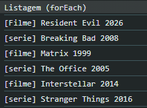
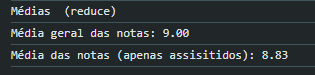
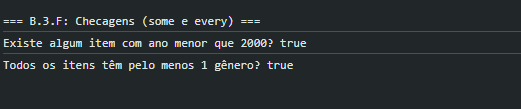
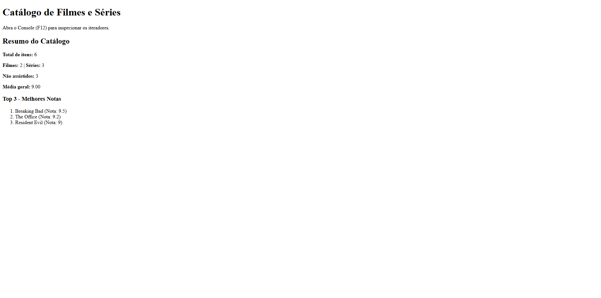

# Atividade Prática - Manipulação de Objetos e Arrays

**Nome:** Bernardo Almeida Andrade
**Matrícula:** [931797]

## 1. Saídas do Console

Abaixo estão as capturas de ecrã demonstrando a execução dos iteradores no navegador:

### Listagem de Títulos

### Cálculo das Médias

### Resumo das Checagens (some e every)

## 2. Resumo na Página (DOM)

Captura de ecrã demonstrando o resumo injetado na div#output:

